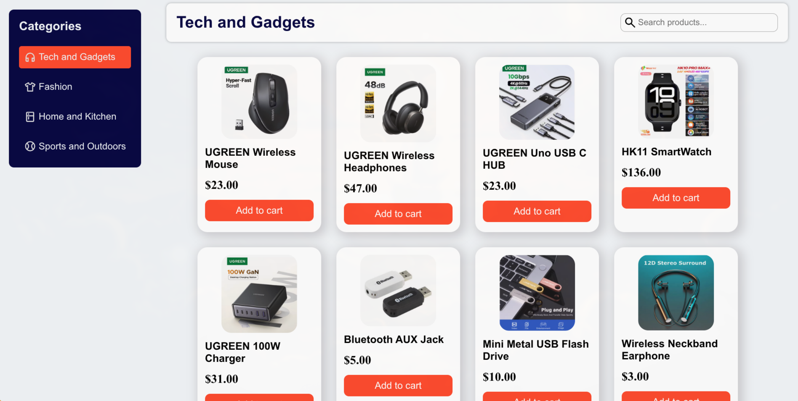
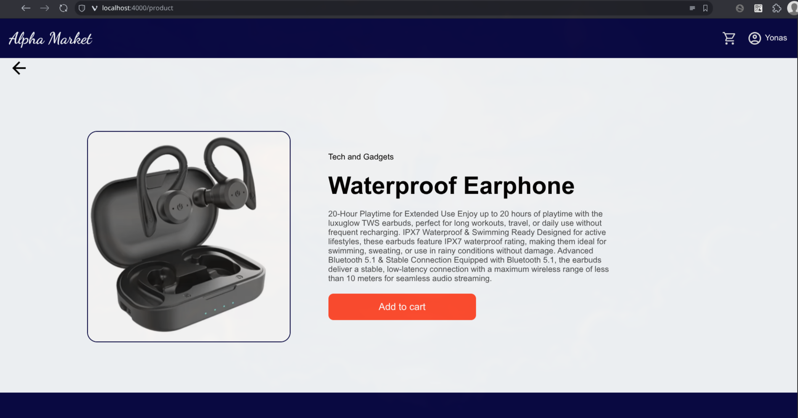
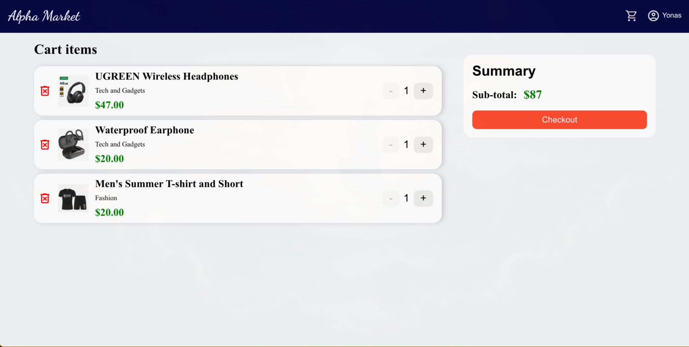
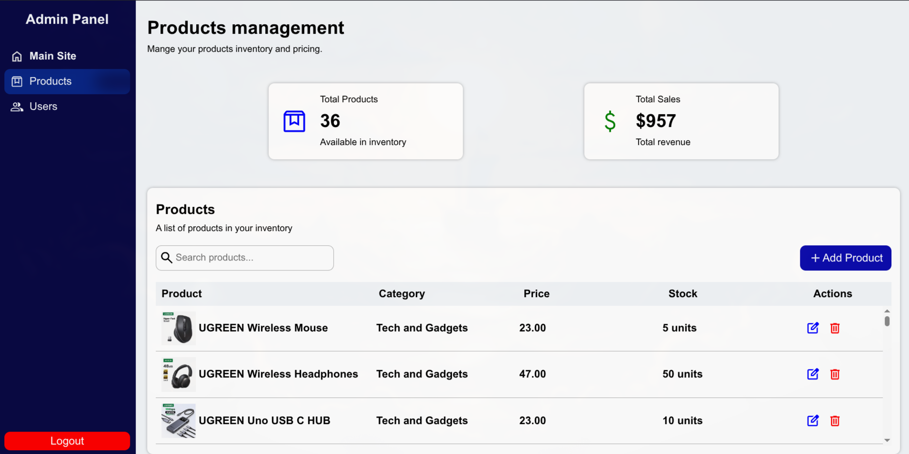
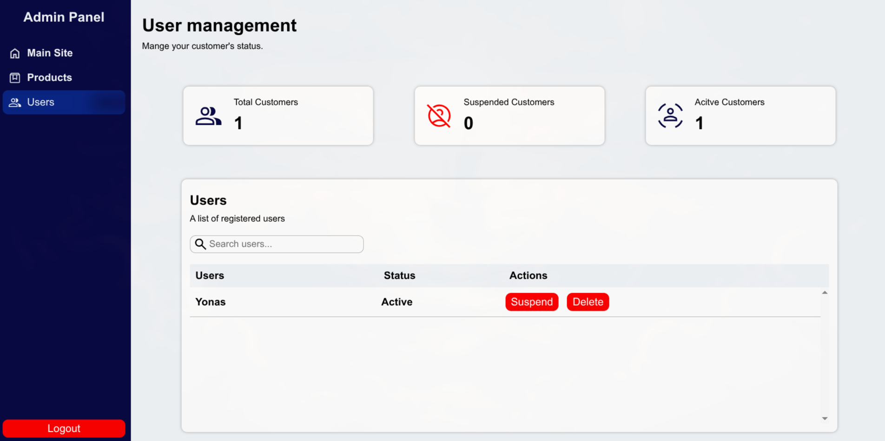

# 🛒 E-Commerce Website

A full-stack e-commerce web application built using **Node.js**, **Express.js**, **MySQL**, **HTML**, **CSS**, and **JavaScript**.

The application allows customers to browse products, manage a shopping cart, create an account, and place orders. It also includes an admin dashboard for managing products and users.

---

## 📸 Screenshots

### Home page


### Product Listing



### Product Page



### Carts



### Admin - Products



### Admin - Users



---

## ✨ Features

### Customer

* User registration and login/logout
* Browse all products
* Search products
* Filter by category
* View product details
* Add products to cart
* Update cart quantities
* Remove products from cart
* Persistent shopping cart
* Checkout Simulation

### Admin

* Secure admin authentication
* Add new products
* Edit existing products
* Delete products
* Product stats (Total products, Total Sales)
* View registered users
* Suspend Users
* Delete Users
* User stats (Total customers, Suspended customers, Active customers)

---

## 🛠️ Tech Stack

### Frontend

* HTML5
* CSS3
* JavaScript

### Backend

* Node.js
* Express.js

### Database

* MySQL

### Other Tools

* Multer (image uploads)
* Express Session
* bcrypt
* dotenv

---

## 🚀 Installation

Clone the repository.

```bash
git clone https://github.com/yonassera/Alpha-E-commerce-Site.git
```

Move into the project folder.

```bash
cd Alpha-E-commerce-Site
```

Install dependencies.

```bash
npm install
```

Create a `.env` file.

```env
PORT=4000
SESSION_SECRET=%%$@hbjbbjkbkv@bjKJBJK
DB_HOST=localhost
DB_USER=root
DB_PASSWORD=123456
DB_NAME=alpha_ecommerce_database
```

## Database Setup

Before running the application, create the MySQL database.

### Option 1: Using MySQL Command Line

Run:

```bash
mysql -u root -p < database/alpha_ecommerce_database.sql
```

This will create the database and all required tables automatically.

### Option 2: Using MySQL Workbench

1. Open MySQL Workbench.
2. Connect to your MySQL server.
3. Open `database/alpha_ecommerce_database.sql`.
4. Click the **Execute** button (lightning bolt).
5. The database and tables will be created automatically.

Start the server.

```bash
npm run start
```

Open your browser.

```
http://localhost:4000
```


---

## 📌 Future Improvements

* Payment gateway integration
* Order history
* Wishlist
* Product reviews
* Email verification
* Password reset
* Product ratings
* Pagination
* Better search and filtering

---

## 📄 License

This project is for educational and portfolio purposes.
